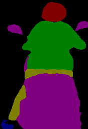
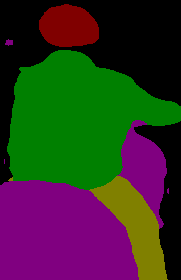
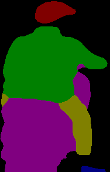
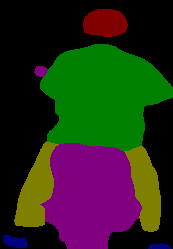

# Semi-Segmentation

I will introduce to you : A model can produce more labeled data for you in segmentation task. I put link source code in U2PL folder.

# Dataset 
You only need images and labels of images put to data\customs\train val and test < both should be in same place>
Create file txt labeled unlabeled and val file  images.

# Experiments
Edit 
```
/experiments/customs/ours/train.sh and config.yaml 
```
In config.yaml change paths and classes
If you want to adjust dataset you can see example in
```
data/custom.py
```

#Training
```
cd experiments/custom/ours
# use torch.distributed.launch
sh train.sh <num_gpu> <port>
```
# Demo
I train with 1000 labeled imgs and 40000 unlabeled. After training, I have additional 4000 labeled.
You can filter to get good images after training and put to U-Net.

<p align="center">
  
  
  
  
</p>
